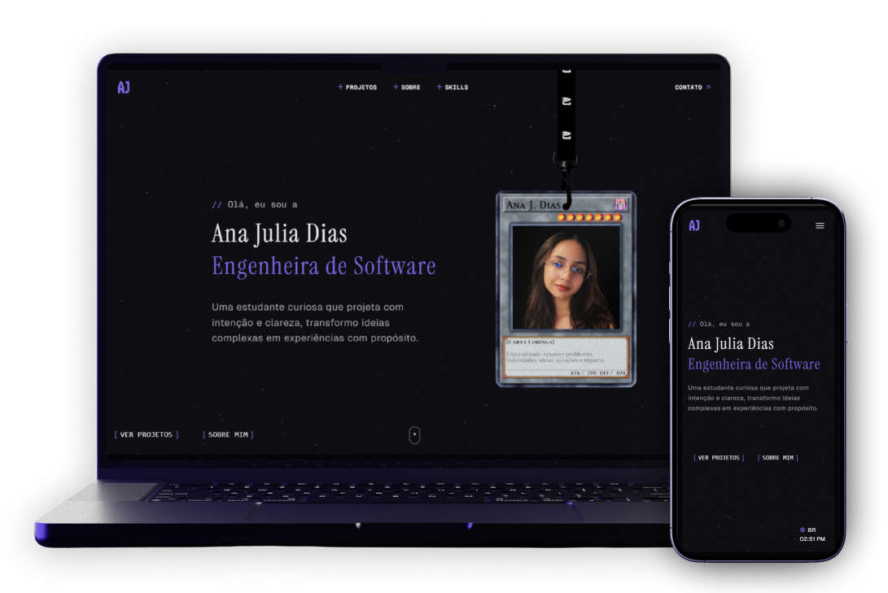

<h1 align="center">
  Portfólio profissional</br>
  <a href="https://najudias.vercel.app/" target="_blank">najudias.tech</a>
</h1>




## 💻 Tecnologias

- Next.js + TypeScript
- React Three Fiber + Rapier (física do Lanyard Card)
- GSAP + Lenis (scroll suave e animações)
- CSS3 + Tailwind CSS
- Framer Motion
- Resend (envio de e-mail do formulário de contato)

---

## 📋 Funcionalidades

- Loading screen com progresso real
- Hero com lanyard interativo e horário local
- Transição de fundo escuro → claro → escuro acompanhando o scroll
- Seção de projetos com modal detalhado (stack, links, descrição)
- Polaroids em 3D na seção Sobre (com stack interativo)
- Layout responsivo trabalhado seção por seção

---

## 🛠️ Rodando localmente

```bash
git clone https://github.com/naju-dias/portfolio.git
cd portfolio
npm install
npm run dev
```

Para o formulário de contato funcionar, crie um arquivo `.env.local` na raiz com:

```bash
RESEND_API_KEY=sua_chave_aqui
```

Abre em `localhost:3000`.

---

## ​🧩​ Estrutura

```
src/
├── app/page.tsx                 # composição das seções + transição de fundo
├── components/
│   ├── layout/                  # Navbar, LoadingScreen
│   ├── sections/                # Hero, Projects, About, Skills, Contact, Footer
│   ├── effects/Lanyard.tsx      # Lanyard Card 3D
│   └── shared/                  # TextScramble, LocalTime, Reveal
├── hooks/                       # useBgTransition, useNavTheme
└── data/projects.ts
```

---

## 🏗️ Arquitetura

Alguns detalhes técnicos por trás da experiência:

- Transição de cor no scroll. O hook useBgTransition calcula a posição de scroll em tempo real via getBoundingClientRect() e interpola a cor de fundo do body em RGB, frame a frame, com easing customizado. Isso permite que a transição escuro → claro → escuro acompanhe a velocidade real do scroll do usuário, em vez de trocar de cor de forma abrupta ao cruzar uma seção.

- Física real. O Lanyard Card usa React Three Fiber + Rapier para simular corda, gravidade e colisão de verdade. O cartão balança e reage ao arrasto do mouse como um objeto físico.

- Animações disparadas por viewport. As seções usam IntersectionObserver para animar elementos só quando entram na tela, evitando o custo de rodar transições fora do viewport e melhorando a performance de scroll.

---

## 🎨​ Design

Tipografia: Tanker (headings), Geist (corpo), Instrument Serif Italic (Hero), Caveat (polaroids), Geist Mono (navbar).

Paleta: fundo escuro `#06060a` com texto roxo `#6758bf` / `#806ded` e branco `#f7f7ff`; </br>
ㅤㅤㅤ fundo claro `#dddadb` com texto roxo `#5e50b1` e preto `#2b2938`.

---

Feito com ❤️ por [Ana Julia Dias](https://www.linkedin.com/in/najudias)
